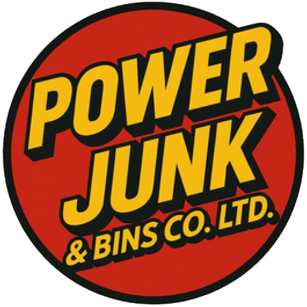
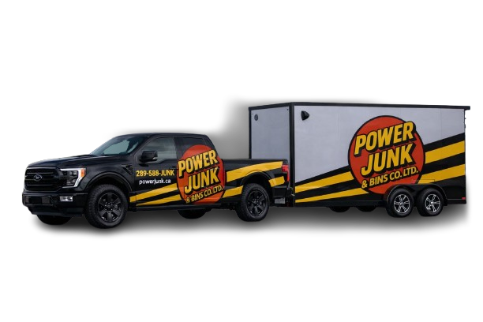

# Power Junk & Bins - Design System
**Template Master: index.html (HOME)**

Este documento define todos os padrões visuais baseados na página HOME para garantir consistência em todas as páginas do site.

---

## 🎨 Cores (Brand Colors)

### Cores Principais
```css
--brand-red: #ED1C24;           /* Vermelho do logo - uso principal */
--brand-red-dark: #C91820;      /* Vermelho escuro - hover states */
--brand-yellow: #FFC72C;        /* Amarelo - tagline banner */
--brand-black: #0f1115;         /* Preto - fundos escuros */
```

### Cores de Texto
```css
--text-primary: #111827;        /* Texto principal */
--text-secondary: #6b7280;      /* Texto secundário/muted */
--text-white: #ffffff;          /* Texto em fundos escuros */
```

### Cores de Fundo
```css
--bg-white: #ffffff;
--bg-light: #f5f5f5;
--bg-cream: #FFF9E6;
--bg-dark: #0f1115;
```

---

## 📝 Tipografia

### Fontes
```css
font-family: 'Montserrat', sans-serif;  /* Headings (H1, H2, H3) */
font-family: 'Open Sans', sans-serif;   /* Body text, paragraphs */
```

### Tamanhos de Heading
```css
/* H1 - Hero Title */
.hero__title {
  font-size: clamp(2.2rem, 4.5vw, 3.8rem);
  font-weight: 800;
  line-height: 1.15;
  letter-spacing: -0.02em;
  color: var(--brand-red);
}

/* H2 - Section Titles */
.section-title {
  font-size: clamp(1.75rem, 3vw, 2.5rem);
  font-weight: 700;
  line-height: 1.2;
  color: #111827;
  margin-bottom: 1rem;
}

/* H3 - Card/Feature Titles */
h3 {
  font-size: 1.25rem;
  font-weight: 700;
  color: #111827;
}
```

### Body Text
```css
/* Paragraph - Normal */
p {
  font-size: 1rem;
  line-height: 1.7;
  color: #333;
}

/* Lead/Subtitle - Larger */
.hero-subtitle-large {
  font-size: 1.125rem;
  line-height: 1.6;
  color: #333;
}

/* Section Description */
.section-description {
  font-size: 1.05rem;
  line-height: 1.7;
  color: #666;
  max-width: 800px;
  margin: 0 auto;
}
```

---

## 🔘 Botões (Buttons)

### Primary Button (CTA Principal)
```html
<a href="#" class="btn btn-primary btn-lg">GET FREE QUOTE</a>
```

```css
.btn-primary {
  background: linear-gradient(135deg, #ED1C24 0%, #C91820 100%);
  color: white;
  padding: 14px 28px;
  border-radius: 50px;
  font-weight: 700;
  font-size: 1rem;
  border: 2px solid #ED1C24;
  box-shadow: 0 8px 16px rgba(237,28,36,0.3);
  transition: all 0.3s ease;
}

.btn-primary:hover {
  background: linear-gradient(135deg, #C91820 0%, #ED1C24 100%);
  transform: translateY(-2px);
  box-shadow: 0 12px 24px rgba(237,28,36,0.4);
}
```

### Outline Button (CTA Secundário)
```html
<a href="tel:+12895885865" class="btn btn-outline btn-lg">📞 CALL NOW</a>
```

```css
.btn-outline {
  background: transparent;
  color: var(--brand-red);
  padding: 14px 28px;
  border-radius: 50px;
  font-weight: 700;
  font-size: 1rem;
  border: 2px solid var(--brand-red);
  transition: all 0.3s ease;
}

.btn-outline:hover {
  background: var(--brand-red);
  color: white;
  transform: translateY(-2px);
}
```

### Tamanhos de Botão
```css
.btn-lg { padding: 14px 28px; font-size: 1rem; }
.btn-md { padding: 12px 24px; font-size: 0.95rem; }
.btn-sm { padding: 10px 20px; font-size: 0.9rem; }
```

---

## 📦 Componentes Padrão

### 1. Header (Mesmo em todas as páginas)
```html
<header class="header">
    <div class="container">
        <div class="header-content">
            <div class="logo">
                <a href="./index.html">
                    
                </a>
            </div>
            <nav>
                <ul class="nav-menu">
                    <li><a href="./index.html">Home</a></li>
                    <li><a href="./index.html#services">Services</a></li>
                    <li><a href="./about-us.html">About</a></li>
                    <li><a href="./contact.html">Contact</a></li>
                </ul>
            </nav>
            <div class="header-phone">
                <a href="tel:+12895885865" class="phone-link">
                    <span style="font-size: 1.5rem;">📞</span> <strong>289-588-5865</strong>
                </a>
            </div>
            <button class="menu-toggle" aria-label="Toggle menu">
                <span>☰</span>
            </button>
        </div>
    </div>
</header>
```

**Regras:**
- ✅ Logo sempre link para index.html
- ✅ Navegação sempre a mesma ordem
- ✅ Telefone sempre visível
- ✅ Mobile menu toggle à direita

---

### 2. Tagline Banner (Mesmo em todas as páginas)
```html
<section class="tagline-banner">
    <div class="container">
        <h2 class="tagline">Making Space for What Matters</h2>
    </div>
</section>
```

**Estilo:**
```css
.tagline-banner {
  background: linear-gradient(135deg, #ED1C24 0%, #C91820 100%);
  padding: 18px 0;
  text-align: center;
}

.tagline {
  color: #FFC72C;
  font-size: 1.5rem;
  font-weight: 800;
  margin: 0;
  text-shadow:
    -1px -1px 0 #000,
    1px -1px 0 #000,
    -1px 1px 0 #000,
    1px 1px 0 #000;
}
```

**Regras:**
- ✅ Sempre vermelho degradê
- ✅ Texto amarelo com contorno preto
- ✅ Mesmo em todas as páginas

---

### 3. Hero Section (Varia por página)

**Estrutura HOME:**
```html
<section id="home" class="hero">
    <div class="container">
        <div class="hero-content">
            <div class="hero-text">
                <h1 class="hero__title">TÍTULO PRINCIPAL</h1>
                <p class="hero-subtitle-large">Subtítulo descritivo</p>

                <ul class="hero-features">
                    <li>Feature 1</li>
                    <li>Feature 2</li>
                    <li>Feature 3</li>
                </ul>

                <!-- Trust Indicators -->
                <div class="hero__trust">
                    <div class="hero__trust-item">
                        <span class="hero__trust-icon">💰</span>
                        <span class="hero__trust-text">No Hidden Fees</span>
                    </div>
                    <!-- ... mais trust items ... -->
                </div>

                <!-- CTAs -->
                <div class="hero-cta">
                    <a href="#" class="btn btn-primary btn-lg hero__cta-primary">
                        GET A FREE QUOTE - FAST RESPONSE
                    </a>
                    <a href="tel:+12895885865" class="btn btn-outline btn-lg hero__cta-secondary">
                        📞 CALL NOW
                    </a>
                </div>
            </div>

            <div class="hero-image">
                
            </div>
        </div>
    </div>
</section>
```

**Regras Hero:**
- ✅ H1 sempre vermelho, grande, bold
- ✅ Subtítulo sempre menor, cinza escuro
- ✅ Features em lista horizontal com badges
- ✅ Trust indicators com ícones
- ✅ Dois CTAs (primary + outline)
- ✅ Imagem à direita (desktop) ou embaixo (mobile)

---

### 4. Certification Bar (Mesmo em todas as páginas)
```html
<div class="cert-bar">
    <div class="container">
        <div class="cert-content">
            <div class="cert-item">
                <div class="cert-icon">✓</div>
                <span>Ministry of Environment Approved</span>
            </div>
            <div class="cert-item">
                <div class="cert-icon">✓</div>
                <span>Licensed Waste Carrier</span>
            </div>
            <div class="cert-item">
                <div class="cert-icon">🇨🇦</div>
                <span>Proudly Canadian-Owned</span>
            </div>
        </div>
    </div>
</div>
```

**Regras:**
- ✅ Sempre após o hero
- ✅ Fundo branco ou cinza claro
- ✅ 3 certificações sempre as mesmas

---

### 5. Section Header Pattern
```html
<div class="section-header">
    <div class="section-subtitle">LABEL PEQUENO EM CAPS</div>
    <h2 class="section-title">Título da Seção<br>Pode ter quebra de linha</h2>
    <p class="section-description">
        Descrição breve da seção explicando o conteúdo.
    </p>
</div>
```

**Estilo:**
```css
.section-subtitle {
  font-size: 0.9rem;
  font-weight: 800;
  letter-spacing: 0.15em;
  color: var(--brand-red);
  text-transform: uppercase;
  margin-bottom: 0.75rem;
}

.section-title {
  font-size: clamp(1.75rem, 3vw, 2.5rem);
  font-weight: 700;
  color: #111827;
  margin-bottom: 1rem;
  line-height: 1.2;
}

.section-description {
  font-size: 1.05rem;
  color: #666;
  max-width: 800px;
  margin: 0 auto 2rem;
  line-height: 1.7;
}
```

---

### 6. Feature Cards (com ícones SVG)
```html
<div class="features-list">
    <div class="feature-item">
        <svg class="feature-icon-small" xmlns="http://www.w3.org/2000/svg" width="48" height="48" viewBox="0 0 24 24" fill="none" stroke="#ED1C24" stroke-width="2.4">
            <!-- SVG path -->
        </svg>
        <div class="feature-text">
            <h3>Título do Feature</h3>
            <p>Descrição breve do feature.</p>
        </div>
    </div>
</div>
```

**Regras:**
- ✅ SVG sempre stroke="#ED1C24"
- ✅ Tamanho 48x48px
- ✅ Alinhamento: ícone à esquerda, texto à direita
- ✅ Grid responsivo (4 cols → 2 cols → 1 col)

---

### 7. Trust Section (Páginas de serviço)
```html
<section class="trust-section">
  <div class="container">
    <div class="section-header">
      <span class="section-tag">BUILT ON TRUST FROM DAY ONE</span>
      <h2>Professional. Transparent. Reliable.</h2>
      <p>Descrição...</p>
    </div>
    <div class="trust-grid">
      <div class="trust-card">
        <div class="trust-icon">💲</div>
        <h3>Transparent Upfront Pricing</h3>
        <p>Clear quotes with no hidden fees.</p>
      </div>
      <!-- ... mais trust cards ... -->
    </div>
    <div class="launch-note">
      <p><strong>Now booking residential & commercial clients in:</strong> Oshawa • Whitby • Ajax • Pickering • Bowmanville</p>
    </div>
    <div class="reviews-placeholder">
      <h3>Customer Reviews</h3>
      <p>We're currently completing our first projects in Durham Region. Verified Google Reviews will appear here as we grow.</p>
    </div>
  </div>
</section>
```

---

### 8. CTA Section (Final de página)
```html
<section id="cta" class="cta-section">
    <div class="container">
        <h2>Need It Gone Today?</h2>
        <p style="font-size: 1.25rem; margin-bottom: 2rem; opacity: 0.95;">
            Get a fast, no-obligation estimate. We respond quickly across Durham Region.
        </p>
        <div class="cta-buttons">
            <a href="#" class="btn btn-primary btn-lg">GET FREE ESTIMATE</a>
            <a href="tel:+12895885865" class="btn btn-outline btn-lg" style="border-color: white; color: white;">📞 289-588-5865</a>
            <a href="mailto:info@powerjunk.ca" class="btn btn-outline btn-lg" style="border-color: white; color: white;">EMAIL US</a>
        </div>
    </div>
</section>
```

**Estilo:**
```css
.cta-section {
  background: linear-gradient(135deg, #ED1C24 0%, #C91820 100%);
  color: white;
  padding: 80px 18px;
  text-align: center;
}

.cta-section h2 {
  color: white;
  font-size: 2.5rem;
  margin-bottom: 1rem;
}
```

**Regras:**
- ✅ Sempre fundo vermelho degradê
- ✅ Texto branco
- ✅ 3 botões (Get Estimate, Phone, Email)
- ✅ Botões outline brancos

---

### 9. Footer (Mesmo em todas as páginas)
```html
<footer class="footer">
    <div class="container">
        <div class="footer-content">
            <!-- 5 colunas: Brand, Services, Service Areas, Company, Contact -->
        </div>
        <div class="footer-trust-line">
            <p>Fully Insured • Responsible Disposal & Donation-First • Family-Owned • Proudly Canadian</p>
        </div>
        <div class="footer-bottom">
            <div class="footer-legal-links">
                <a href="/privacy.html">Privacy Policy</a>
                <a href="/terms.html">Terms of Service</a>
                <a href="/sitemap.xml">Sitemap</a>
            </div>
            <p>&copy; 2026 Power Junk & Bins CO. LTD. All rights reserved.</p>
        </div>
    </div>
</footer>
```

---

### 10. WhatsApp Float Button (Mesmo em todas as páginas)
```html
<div class="whatsapp-float" title="Chat with us on WhatsApp">
    <svg viewBox="0 0 448 512" xmlns="http://www.w3.org/2000/svg">
        <path d="M380.9 97.1C339 55.1..."/>
    </svg>
</div>
```

---

## 📐 Espaçamentos Padrão

### Padding de Seções
```css
.section { padding: 72px 18px; }      /* Desktop */
.pj-section { padding: 70px 0; }     /* Wrapper sections */

@media (max-width: 768px) {
  .section { padding: 48px 18px; }    /* Mobile */
}
```

### Margens
```css
/* Entre elementos */
margin-bottom: 1rem;    /* 16px - pequeno */
margin-bottom: 1.5rem;  /* 24px - médio */
margin-bottom: 2rem;    /* 32px - grande */
margin-bottom: 3rem;    /* 48px - seções */
```

---

## 🎯 Grid Patterns

### 2 Colunas (Residential/Commercial)
```css
.service-types-grid {
  display: grid;
  grid-template-columns: repeat(2, 1fr);
  gap: 2rem;
}

@media (max-width: 768px) {
  .service-types-grid {
    grid-template-columns: 1fr;
  }
}
```

### 3 Colunas (Features, What We Remove)
```css
.removal-categories-grid {
  display: grid;
  grid-template-columns: repeat(3, 1fr);
  gap: 2rem;
}

@media (max-width: 1024px) {
  .removal-categories-grid {
    grid-template-columns: repeat(2, 1fr);
  }
}

@media (max-width: 640px) {
  .removal-categories-grid {
    grid-template-columns: 1fr;
  }
}
```

### 4 Colunas (Process Steps)
```css
.process-steps {
  display: grid;
  grid-template-columns: repeat(4, 1fr);
  gap: 2rem;
}

@media (max-width: 1000px) {
  .process-steps {
    grid-template-columns: repeat(2, 1fr);
  }
}

@media (max-width: 520px) {
  .process-steps {
    grid-template-columns: 1fr;
  }
}
```

---

## ✅ Checklist para Criar Nova Página

Ao criar qualquer nova página de serviço, siga este checklist:

### 1. Estrutura HTML Base
- [ ] Copiar `<head>` de index.html (fonts, favicon, CSS)
- [ ] Atualizar `<title>` e `<meta description>` para o serviço específico
- [ ] Adicionar schema markup apropriado (Service ou LocalBusiness)

### 2. Componentes Obrigatórios (ordem fixa)
1. [ ] Header (cópia exata de index.html)
2. [ ] Tagline Banner (cópia exata)
3. [ ] Hero Section (customizado para o serviço)
4. [ ] Certification Bar (cópia exata)
5. [ ] Why Choose Section (com SVG icons)
6. [ ] Conteúdo específico do serviço
7. [ ] Trust Section
8. [ ] CTA Section (vermelho degradê)
9. [ ] Footer (cópia exata)
10. [ ] WhatsApp Float (cópia exata)
11. [ ] JavaScript link

### 3. Design Consistency
- [ ] Todas as cores seguem paleta definida
- [ ] Botões usam .btn-primary ou .btn-outline
- [ ] Headings seguem hierarquia (H1 → H2 → H3)
- [ ] Ícones SVG em vermelho (#ED1C24)
- [ ] Espaçamentos consistentes (72px desktop, 48px mobile)
- [ ] Grids responsivos (4→2→1 ou 3→2→1 ou 2→1)

### 4. SEO
- [ ] H1 único e descritivo
- [ ] Meta description < 160 caracteres
- [ ] Schema markup apropriado
- [ ] Links internos para outras páginas
- [ ] Alt text em todas as imagens

### 5. Links & CTAs
- [ ] Jobber booking link atualizado
- [ ] Telefone: +12895885865
- [ ] Email: info@powerjunk.ca
- [ ] Links para city pages (se aplicável)

---

## 🚫 Erros Comuns a Evitar

❌ **NÃO faça:**
- Usar vermelho diferente de #ED1C24
- Mudar fonte Montserrat/Open Sans
- Alterar header ou footer
- Criar botões com estilos diferentes
- Usar H1 múltiplas vezes
- Esquecer tagline banner
- Pular certification bar

✅ **SEMPRE faça:**
- Seguir ordem de componentes da HOME
- Usar classes CSS existentes
- Manter consistência visual
- Testar responsividade (mobile/tablet/desktop)
- Copiar exatamente header/footer/tagline

---

## 📱 Breakpoints Responsivos

```css
/* Mobile First */
@media (min-width: 640px) { /* Tablet */ }
@media (min-width: 768px) { /* Desktop small */ }
@media (min-width: 1024px) { /* Desktop medium */ }
@media (min-width: 1280px) { /* Desktop large */ }
```

---

## 🔗 Links Importantes

**Jobber Booking:**
- Main: `https://clienthub.getjobber.com/hubs/5cf50739-65c7-4cce-a4cb-c70a724eb64f/public/requests/2133722/new`

**Contato:**
- Telefone: `tel:+12895885865` (289-588-5865)
- Email: `mailto:info@powerjunk.ca`

**Navegação:**
- Home: `./index.html`
- Services: `./index.html#services`
- About: `./about-us.html`
- Contact: `./contact.html`

---

**Última atualização:** 2026-02-16
**Template Master:** index.html
**Páginas usando este sistema:** index.html, junk-removal.html (e todas futuras)
